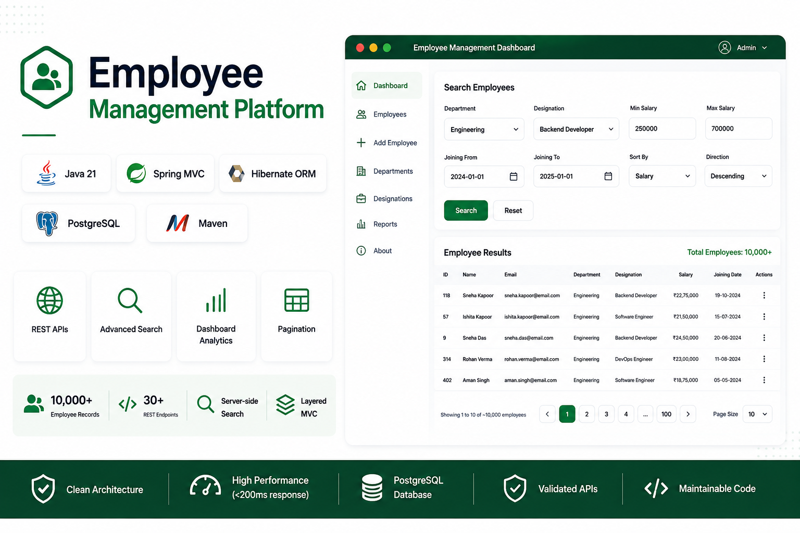

<p align="center">
  
</p>

A full-stack employee management platform built with Java 21, Spring MVC, Hibernate ORM, and PostgreSQL. The project
demonstrates clean layered architecture, RESTful API design, scalable server-side data processing, and a modular vanilla
JavaScript frontend.

<p align="center">
  
  
  
  
  
</p>

---

## Overview

Employee Management Platform is a full-stack web application for managing workforce information through a RESTful
backend and responsive single-page frontend.

The project emphasizes practical backend engineering principles including layered architecture, DTO-driven APIs,
centralized validation, efficient data retrieval, reusable frontend modules, and scalable server-side filtering,
sorting, and pagination validated against large datasets.

---

## Engineering Highlights

- Layered Controller → Service → Repository architecture
- Spring MVC REST APIs
- Hibernate ORM persistence
- DTO-based request and response models
- Bean Validation
- Centralized exception handling
- Dynamic server-side filtering, sorting, and pagination
- Dashboard analytics and workforce summaries
- Modular ES6 frontend architecture
- Reusable API, UI, and utility modules

---

## Performance Validation

The application was validated using a production-style dataset to evaluate scalability and query performance.

- Tested with **10,000+ realistic employee records**
- Fully server-side filtering, sorting, and pagination
- Typical API response times below **200 ms** during local testing
- Optimized Hibernate query execution for large dataset retrieval

---

## Demo

The demonstration includes:

- Dashboard
- Employee CRUD
- Advanced Search
- Sorting
- Pagination
- Validation
- Dashboard Analytics
- Department Summary
- Designation Summary
- REST API Testing (Postman)

🎥 Demo Video

---

## Key Features

### Employee Management

- Employee CRUD operations
- Duplicate email validation
- Client-side and server-side validation
- Confirmation workflows
- Toast notifications

### Workforce Analytics

- Dashboard metrics
- Department summaries
- Designation summaries
- Salary analytics
- Employee distribution insights

### Advanced Search

- Department filtering
- Designation filtering
- Salary range filtering
- Joining date filtering
- Dynamic sorting
- Server-side pagination

---

## Architecture

```text
Frontend (SPA)
      │
      ▼
Spring MVC Controllers
      │
      ▼
Service Layer
      │
      ▼
Repository Layer (Hibernate ORM)
      │
      ▼
PostgreSQL
```

The frontend communicates exclusively through REST APIs, maintaining a clear separation between presentation, business
logic, and persistence.

---

## Technology Stack

| Layer      | Technologies                                  |
|------------|-----------------------------------------------|
| Backend    | Java 21, Spring MVC 6, Hibernate ORM 6        |
| Database   | PostgreSQL                                    |
| API        | REST, JSON                                    |
| Validation | Bean Validation                               |
| Frontend   | HTML5, CSS3, Vanilla JavaScript (ES6 Modules) |
| Build      | Apache Maven                                  |
| Deployment | WAR, Apache Tomcat                            |

---

## Project Structure

```text
employee-management-platform/
│
├── docs/
│
├── frontend/
│   ├── assets/
│   ├── components/
│   ├── pages/
│   ├── router/
│   ├── services/
│   └── utils/
│
├── src/
│   └── main/
│       ├── java/
│       │   └── com/satish/employeemanagementmvc/
│       │       ├── config/
│       │       ├── controller/
│       │       ├── dto/
│       │       ├── entity/
│       │       ├── exception/
│       │       ├── mapper/
│       │       ├── repository/
│       │       └── service/
│       │
│       ├── resources/
│       └── webapp/
│
├── pom.xml
└── README.md
```

---

## Getting Started

### Prerequisites

- Java 21
- Maven 3.9+
- PostgreSQL
- Apache Tomcat 10+

### Clone

```bash
git clone <repository-url>
cd employee-management-platform
```

### Configure Database

Update:

```text
src/main/resources/database.properties
```

Configure:

- JDBC URL
- Username
- Password
- Hibernate Dialect

### Build

```bash
mvn clean package
```

### Deploy

Deploy the generated WAR file to Apache Tomcat.

---

## API Modules

The application exposes REST APIs for:

- Employee Management
- Dashboard Analytics
- Department Summary
- Designation Summary
- Employee Search
- Email Validation

---

## Engineering Notes

Rather than relying on Spring Boot abstractions, this project intentionally uses Spring MVC to demonstrate a deeper
understanding of servlet-based web applications, request handling, dependency wiring, layered architecture, and ORM
integration.

The application was validated using a realistic dataset containing over **10,000 employee records**, demonstrating
efficient server-side search, filtering, sorting, pagination, and dashboard analytics under larger workloads.

---

## Future Improvements

- Spring Boot migration
- Authentication & Authorization
- Docker support
- CI/CD pipeline
- Unit & Integration Testing
- OpenAPI Documentation

---

## License

This project is intended for educational and learning purposes.